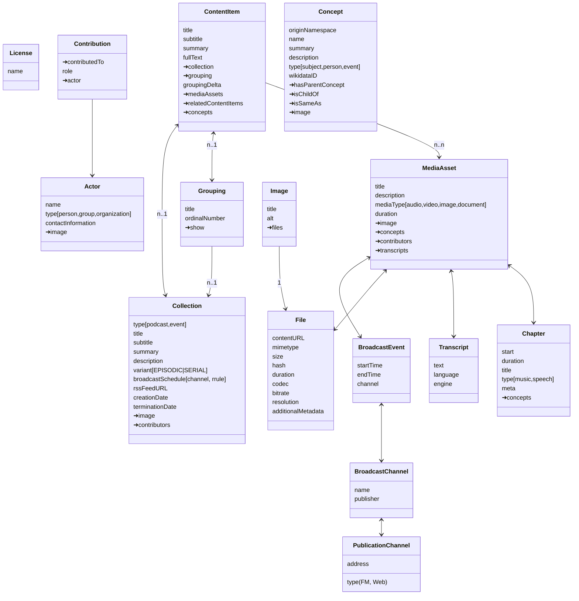

# repco data model

repco defines a data model for the exchange of community media. This represenation is developed to suit a number of domains: Podcasts, community radio and television, conference recordings, collections of cultural heritage, arts.
The data model is intended to be generic enough to fit these domains, and also be specific enough to become a shared basis for replication and shared frontends.

The ➜ sigil before a field name denotes that this field is a relation (link) to another entity. Not all relations are marked in the doc, see below for relations left out for clarity of the diagram.

Some relations are left out in the diagram to keep things clearer. Relations not in the diagram but part of the datamodel are:

`License` is linked from `MediaAsset`, `ContentItem`, `Show`, `PublicationChannel`

`Image` is linked from `MediaAsset`, `ContentItem`, `Show`, `Chapter`, `Grouping`

`Contribution` is linked from `MediaAsset`, `ContentItem`, `Collection`

