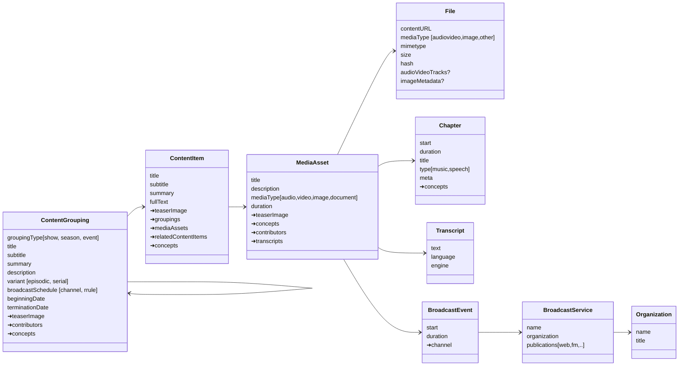
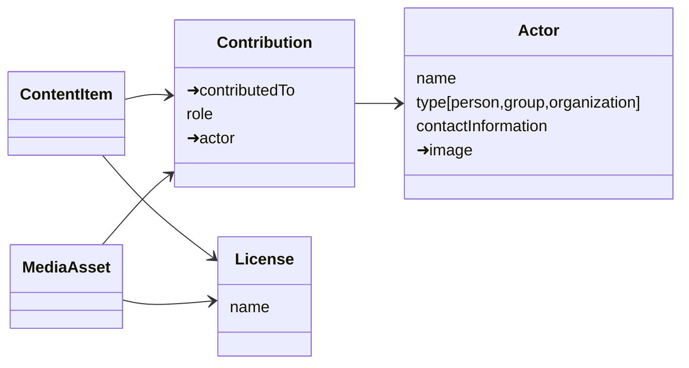
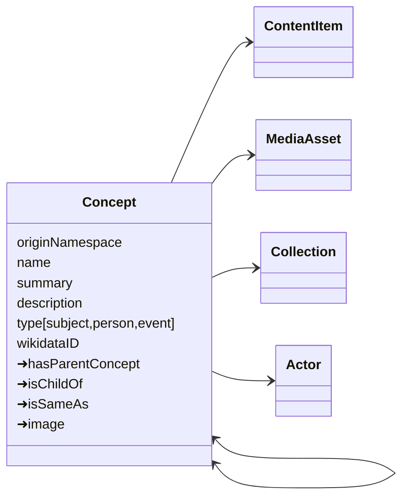

_This document is a work in progress. In this case it is about a discussion process for the RDDM. It is not up to date, but it contains findings about the relations of the entities._

# repco data model

repco defines a data model for the exchange of community media. This represenation is developed to suit a number of domains: Podcasts, community radio and television, conference recordings, collections of cultural heritage, arts.
The data model is intended to be generic enough to fit these domains, and also be specific enough to become a shared basis for replication and shared frontends.

### domain model

The ➜ sigil before a field name denotes that this field is a relation (link) to another entity. Not all relations are marked in the doc, see below for relations left out for clarity of the diagram.

actors and contributions:

Some relations are left out in the diagram to keep things clearer. Relations not in the diagram but part of the datamodel are:

`License` is linked from `MediaAsset`, `ContentItem`, `Show`, `PublicationChannel`

`Image` is linked from `MediaAsset`, `ContentItem`, `Show`, `Chapter`, `Grouping`

`Contribution` is linked from `MediaAsset`, `ContentItem`, `Collection`

### tagging and categorization

For denoting categories, subjects, tags and similar means of categorizing content, we are looking into a simple-yet-powerful nested and namespaced `Concept` model. Most entity types from above will feature a `concepts` field that relates an entity to one or more `Concept`s. Concepts themselves can be related to other concepts, both in a is-same-as relationship and in a hierarchical relationship. Concepts may be namespaced to make importing existing tagging hierarchies from third parties straightforward.

### IDs, headers and changes

- all entities have an `id` property. Q: Will this be an internal or external id?
- all entities have an `alternativeIDs` property with a list of alternative IDs
- more metadata for tracking changes in a `header` property?

_tbd_
