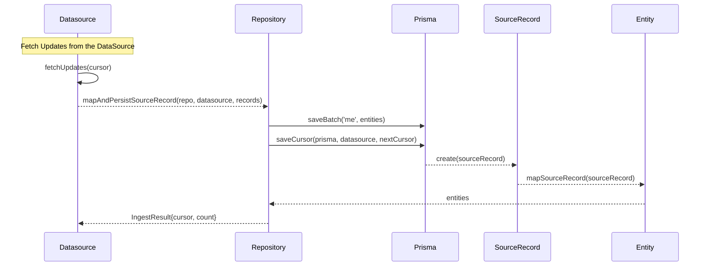
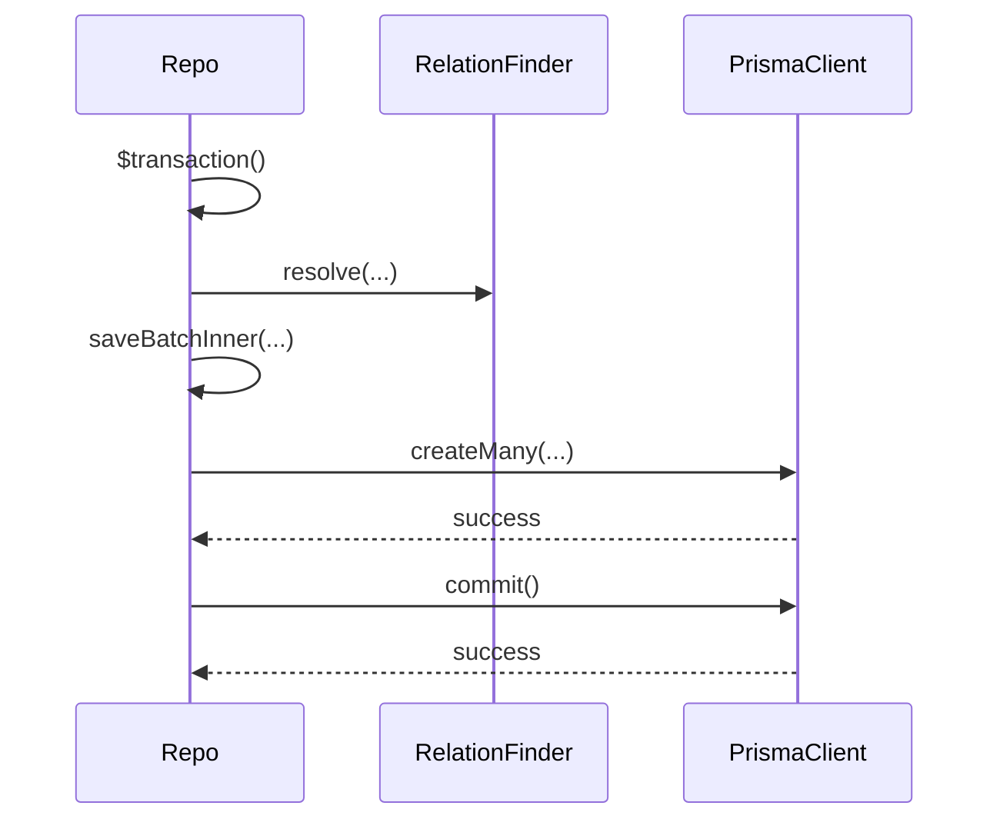
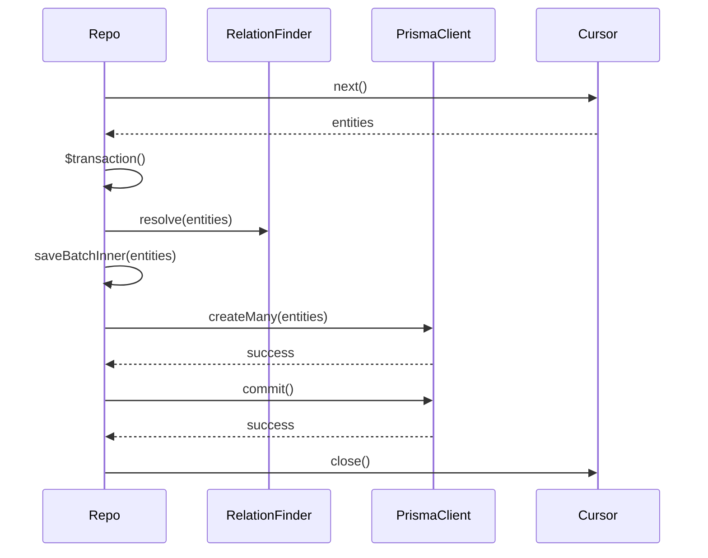
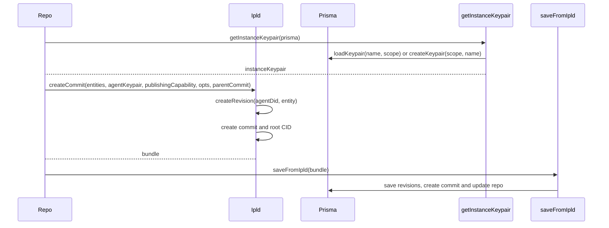
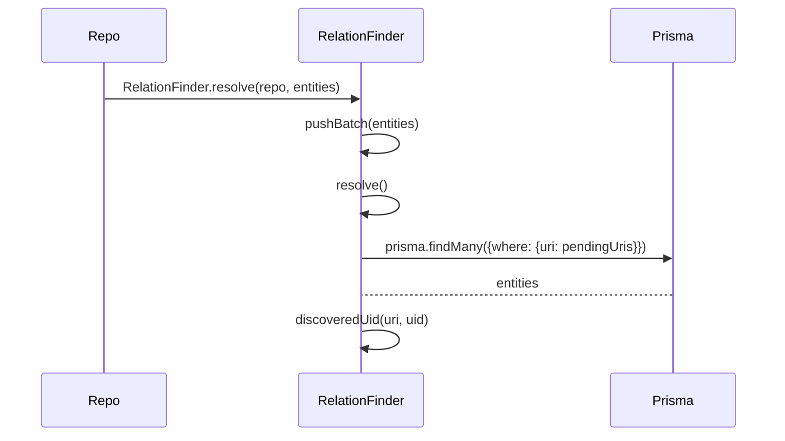

_This document is a work in progress._

# Architecture

Here we provide a brief overview of the structure and functionality of Repco supplemented by diagrams to improve understanding.

### Datasource

The datasource is the entry point into Repco a new datasource is implemented gets the new (and old contributions) and maps them to the Repco data model which is then made available in a repository to replicate to other nodes. for more details see the docs

### Repo

#### savebatch

#### saveCursor

#### saveBatchInner

### RelationFinder

