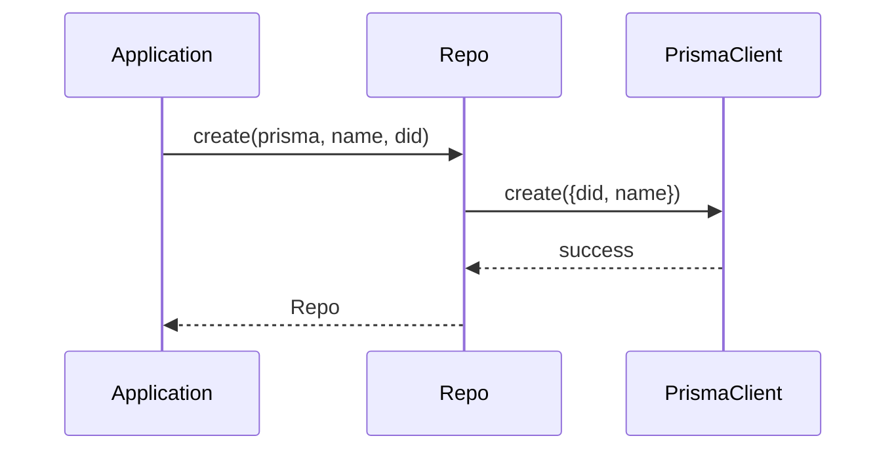
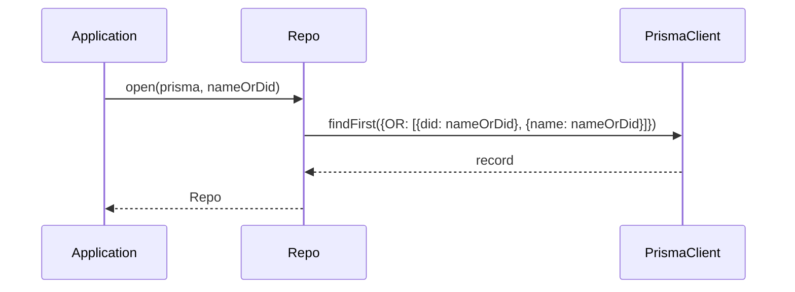
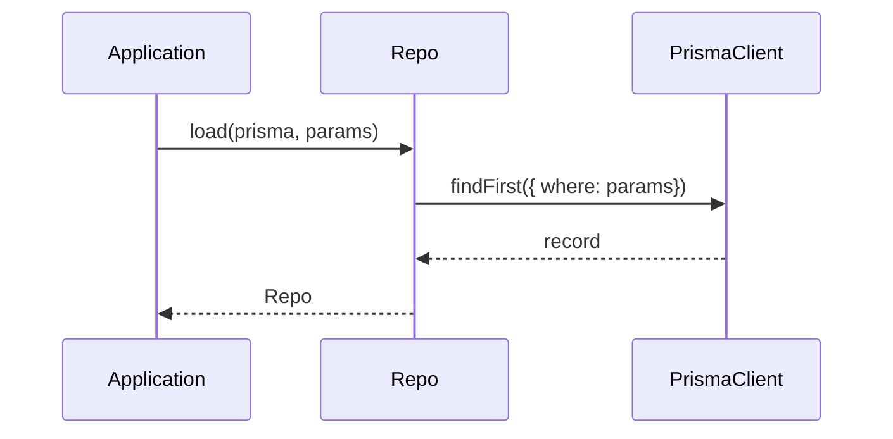
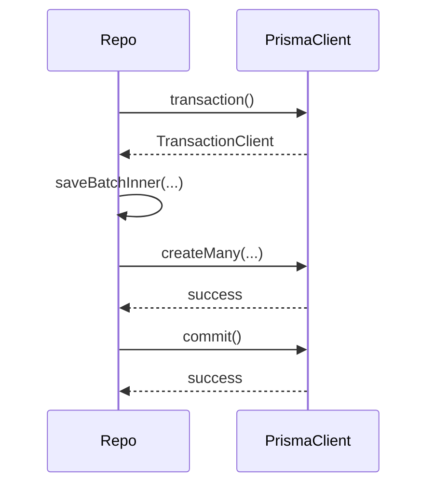

## repo 
### create

```mermaid
sequenceDiagram
    participant Application
    participant Repo
    participant PrismaClient
    Application->>Repo: create(prisma, name, did)
    Repo->>PrismaClient: create({did, name})
    PrismaClient-->>Repo: success
    Repo-->>Application: Repo

```

### open / load

```mermaid
sequenceDiagram
    participant Application
    participant Repo
    participant PrismaClient
    Application->>Repo: open(prisma, nameOrDid)
    Repo->>PrismaClient: findFirst({OR: [{did: nameOrDid}, {name: nameOrDid}]})
    PrismaClient-->>Repo: record
    Repo-->>Application: Repo
```

```mermaid
sequenceDiagram
    participant Application
    participant Repo
    participant PrismaClient
    Application->>Repo: load(prisma, params)
    Repo->>PrismaClient: findFirst({ where: params})
    PrismaClient-->>Repo: record
    Repo-->>Application: Repo

```

### transaction

```mermaid
sequenceDiagram
    participant Repo
    participant PrismaClient
    Repo->>PrismaClient: transaction()
    PrismaClient-->>Repo: TransactionClient
    Repo->>Repo: saveBatchInner(...)
    Repo->>PrismaClient: createMany(...)
    PrismaClient-->>Repo: success
    Repo->>PrismaClient: commit()
    PrismaClient-->>Repo: success
```