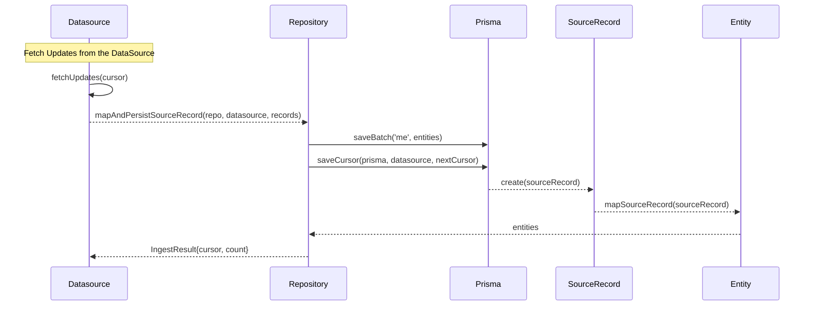
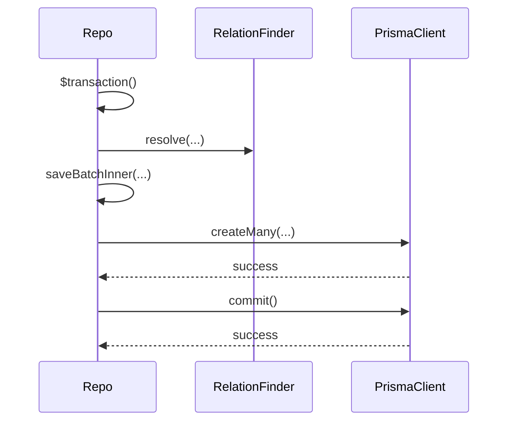
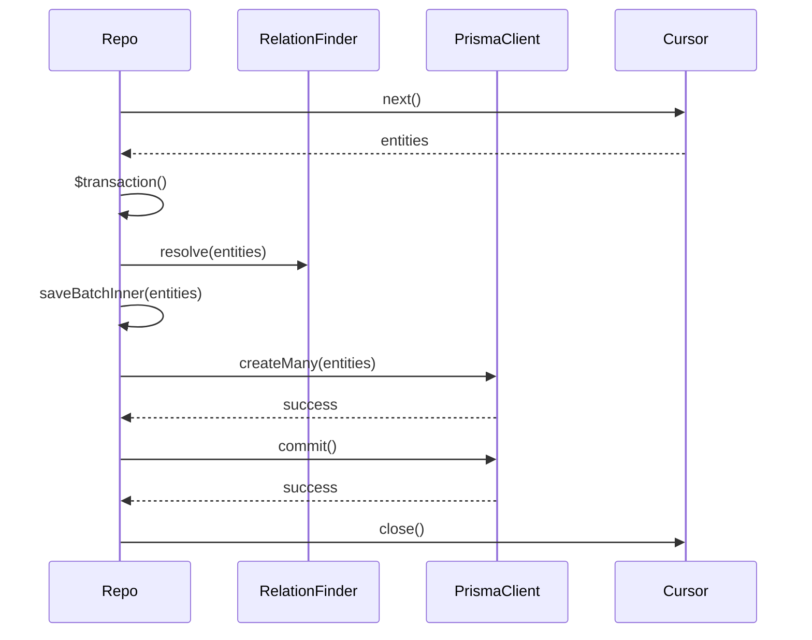
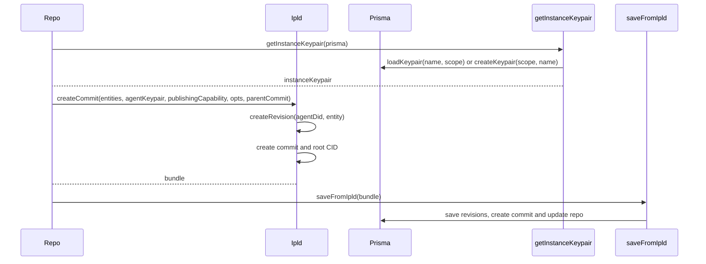
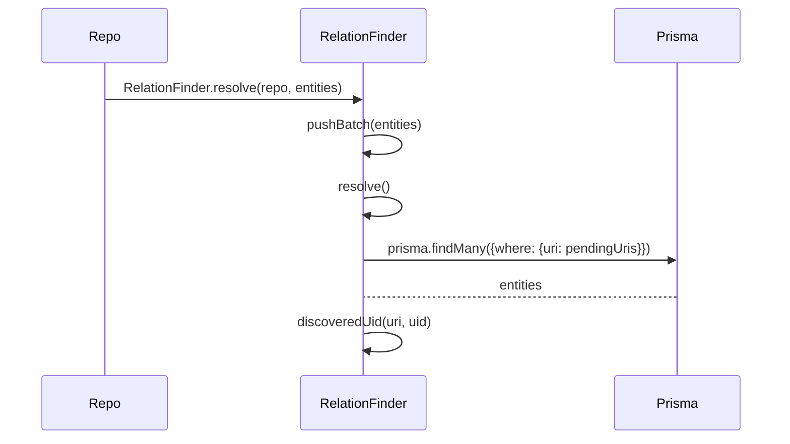

# Architecture and Strategy

This part is not complete and still WIP

## Strategy:

1. Data Model: The Repco data model is defined as a Prisma schema and is divided into two data models: the Repco Domain Data Model (RDDM) and the Repco Lower Data Model (RLDM). The RLDM defines the common entities, relations, and headers needed to manage, replicate, and distribute the content and media of the publishers in Repco. The RDDM defines entities that are managed in the RLDM. It is important to understand the data model and its relationships to effectively design and implement the application.

2. Data Sources: Repco supports different data sources and make it easy to add new data sources. The application should be designed to abstract the data sources and provide a unified interface for data access.

3. Data Replication: Repco replicates community media content between different Repco nodes. The replication process should be designed to be efficient, reliable, and easy to use. The application should also provide monitoring and reporting capabilities to track the replication process and troubleshoot any issues that may arise.

4. API: Repco provides a public-facing API for accessing community media content. The API should be designed to be intuitive and easy to use, and should provide access to the functionality provided by the application.

5. Security: Repco stores and manages sensitive user data, so it must be designed to protect the security and privacy of this data. The application should be designed to comply with industry standards for data security and privacy.

6. Compliance: Depending on the country or region the application will be used, it may be subject to certain compliance regulations such as GDPR, HIPAA, etc. The application should be designed to comply with these regulations.

7. Scalability: Repco is designed to be scalable, but there may be limitations on the number of users, the amount of data and the number of requests that the application can handle. The application should be designed to be horizontally scalable and should be optimized for performance.

8. Technical stack: Repco is built using TypeScript, PostgreSQL, Prisma, and Postgraphile. It is important to be familiar with these technologies and their limitations to effectively design and implement the application.

9. Continuous integration and delivery: Repco is an open-source project and it's important to have a good pipeline for building, testing and deploying the application. To ensure that the application is stable and reliable, it is important to have a good continuous integration and delivery process.

10. Community engagement: Repco is a community project, it's important to engage with the community and get feedback throughout the development process. This will help to ensure that the application meets the needs of the community and that any issues are addressed in a timely manner.

## Architecture:

Here we provide a brief overview of the structure and functionality of repco supplemented by diagrams to improve understanding. 

### Datasource

The datasource is the entry point into repco a new datasource is implemented gets the new (and old contributions) and maps them to the repco data model which is then made available in a repository to replicate to other nodes. for more details see the docs

### Repo

#### savebatch

#### saveCursor

#### saveBatchInner

### RelationFinder

