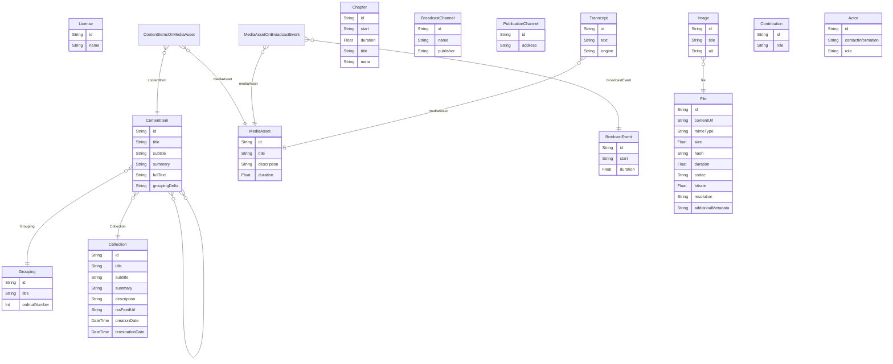

```mermaid
erDiagram

  License {
    String id
    String name
    }
  

  ContentItem {
    String id
    String title
    String subtitle
    String summary
    String fullText
    String groupingDelta
    }
  

  ContentItemsOnMediaAsset {

    }
  

  MediaAsset {
    String id
    String title
    String description
    Float duration
    }
  

  MediaAssetOnBroadcastEvent {

    }
  

  Chapter {
    String id
    String start
    Float duration
    String title
    String meta
    }
  

  BrodcastEvent {
    String id
    String start
    Float duration
    }
  

  BroadcastChannel {
    String id
    String name
    String publisher
    }
  

  PublicationChannel {
    String id
    String address
    }
  

  Transcript {
    String id
    String text
    String engine
    }
  

  Grouping {
    String id
    String title
    Int ordinalNumber
    }
  

  Collection {
    String id
    String title
    String subtitle
    String summary
    String description
    String rssFeedUrl
    DateTime creationDate
    DateTime terminationDate
    }
  

  File {
    String id
    String contentUrl
    String mimeType
    Float size
    String hash
    Float duration
    String codec
    Float bitrate
    String resolution
    String additionalMetadata
    }
  

  Image {
    String id
    String title
    String alt
    }
  

  Contribution {
    String id
    String role
    }
  

  Actor {
    String id
    String contactInformation
    String role
    }
  
    ContentItem o{--|| Collection : "Collection"
    ContentItem o{--|| Grouping : "Grouping"
    ContentItem o{--}o ContentItem : ""
    ContentItem o{--}o ContentItem : ""
    ContentItemsOnMediaAsset o{--|| ContentItem : "contentItem"
    ContentItemsOnMediaAsset o{--|| MediaAsset : "mediaAsset"
    MediaAssetOnBroadcastEvent o{--|| MediaAsset : "mediaAsset"
    MediaAssetOnBroadcastEvent o{--|| BrodcastEvent : "broadcastEvent"
    Transcript o{--|| MediaAsset : "mediaAsset"
    Image o{--|| File : "file"
```
